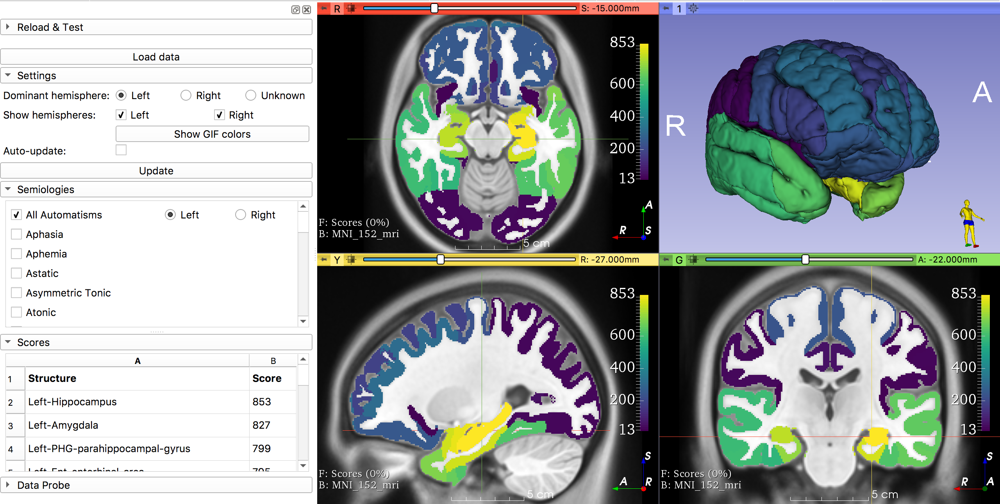

# Epilepsy Seizure Semiology-to-Brain Visualisation Tool (SVT) - v 1.7.1
## Seizure Semiology lateralisation and localisation information from 4,643 patients' data from 309 included original journal papers
### 11230 localising and 2391 lateralising datapoints

For research purposes only. Not for clinical use.

  

Figure from beta-version:
849 Patients with automatisms have an epileptogenic zone localising mostly to the mesial temporal lobe.
124 of these lateralise, mainly ipsilaterally.

Sankey Diagram overview of Semio2Brain Database, Filters, SemioDict, and broad localisation mapppings. SVT uses finer GIF localisation parcellations. 

## slicer module
We integrated our **Semio2Brain database**, **taxonomy**, brain region **mappings** to gif MNI space parcellations, **ground truths** and **Bayesian filters** (for exclusion of patients from studies that preselected patients based on prior knowledge of the region of seizure onset, to mitigate the publication bias that favours temporal lobe epilepsy) in a Python module for the 3D Slicer program, to create a novel user-friendly and open-source **Semiology Visualisation Tool (SVT)** in the form of a GUI. This allows 3D-brain visualisations of semiologies and their simultaneous combinations. Instead of idenitifying symptomatogenic zones, we therefore visualise the most likely original sources of the seizures from initial or most prominent semiology.

GUI options include filtering paediatric cases and determining the laterality of your patient's dominant hemisphere, ticking checkboxes for your patient's semiology and determining the laterality of the semiology.

Further details on the above can be found in the description of the (backend) mega_analysis module below.

## mega_analysis (backend) module

### 1. Resources: Semio2Brain Database  v 1.2.2 309 studies
(19th Aug 2020, 310 studies)
v 1.0.0 (early Aug 2020)
100% of the Data: 4,649 patients' data from 312 included original journal papers
#### Until the 5th Aug 2020 the Beta version was used, named syst_review_single_table - 47% (146/312 included studies integrated)
We curated the largest patient-level database of 4649 unique patients' semiologies from 312 studies, yielding over ten thousand lateralising and localising datapoints for initial or most prominently reported seizure semiologies. These patient-level seizure-semiology data-points (where 1 point corresponds to 1 patient, presenting with a particular seizure semiology) were extracted from selected peer-reviewed journal publications, if at least one of the following ground-truth criteria regarding the certainty of lateralisation and/or localisation was satisfied:

* Post-operative seizure freedom (ILAE 1,2 = Engel Ia,Ib; but also Engel I if not otherwise specified), confirmed at a minimum follow-up of 12 months;
* Invasive EEG recording and/ or electrical stimulation, mapping seizure semiology;
* Multi-modal concordance between brain imaging & neurophysiology (e.g. PET, SPECT, MEG, EEG, fMRI) in pointing towards a highly probable epileptogenic zone.

The data are also tagged to allow Bayesian filtering of patient semiologies from studies which preselected patients with known brain seziure-region zones (whether this be epileptogenic zones or seizure onset zones) in order to allow mitigation of publications bias which favours temporal lobe epilepsy (e.g. of invasive EEG electrode targets) to allow filtering out specific paper/patient-level priors:

* Epilepsy Topology (ET): when the paper selects sample of patients based on their established epileptogenic zone (site of surgical resection) or seizure onset zone (neurophysiological/anatomical), and describes the related seizure semiology - e.g. papers looking at TLE, FLE, OLE;
* Spontaneous Semiology (SS): when the paper pre-selects a sample of patients based on their seizure semiology
  (e.g. nose-wiping, gelastic, ictal kissing), or
  reports on a cohort of unselected patients with epilepsy, or
  pre-selects based on other non-topological factors (specific techniques or conditions e.g. FCD) and provides details of epileptogenic zone localisation/lateralisation
* Cortical Electrical Stimulation (CES/ES): when the paper describes the semiology elicited by electrical brain stimulation, in the context of pre-/ intra-surgical functional mapping.
* If new data is to be added, must include paediatric under 7 label, and if postictal, must be typed "postictal" and not in any other format.

### 2. Resources: Semiology_Dictionary Taxonomy Replacement (SemioDict) - v 1.1.1
[See our Wiki page for more details on the semiology categories and their semantic synonyms.](https://github.com/thenineteen/Semiology-Visualisation-Tool/wiki)

* Aug 2020:v 1.0.1 56+1 semiology categories
* v 1.0.0, 55+1 semiologies
* Up to May 2020: v 0.9.1 (47 semiologies)

### 3. Resources: lateralisation and localisation mappings - v 1.1.9 (Aug 2020, 103 localisation labels, Calibrations for minor versions)
until 5th Aug - v 1.0.8 (55 localisation labels)
To query this database, we developed a taxonomy of 55 semiological terms (+ 1 "no semiology" for cortical stimulation studies), mapped reported categorical brain regions to 103 localising cerebral atlas labels and 5 lateralising
possibilities (contra- or ipsi- lateral, dominant or non-dominant hemisphere and bilateral).

The mega_analysis module cleans the DataFrame of data, pivots occurences of semiology, allowing for semiology_dictionary taxonomy replacement regex searches, maps the documented localisations to gif parcellations and can scale these mappings using different scalers/transformers.

Data can be filtered based on the above ground truths, Bayesian priors and other exclusions.

## Installation Guide
1. Clone (or [download](https://github.com/thenineteen/Semiology-Visualisation-Tool/archive/master.zip) and extract) this repository
2. Download a [**Preview Release** of 3D Slicer](https://download.slicer.org/) (not the Stable version)
3. Install and open Slicer
4. Go to the menu `Edit` > `Application Settings` > `Modules` > `Additional module paths` > `Add` (you may have to click on the double arrows to the right of Additional Module Paths)
5. Click on the directory to which you cloned this repository > click on the `slicer` folder and click `Select Folder`
6. Click on `OK` and restart Slicer when prompted
7. To open the module, click on the magnifier and search for `Semiology`, then click on the module as below.
It may take a few minutes to load for the first time.

8. You might need to restart Slicer again, if prompted
9. You can now click on the "Load data" button as below, and the SVT software will soon be ready for you to query the database:

### Funding
Wellcome/EPSRC Centre for Interventional and Surgical Sciences (WEISS) (203145Z/16/Z).
